# 🩺 MahaArogya Setu — Smart Multilingual Rural Healthcare Platform

[-000000.svg?style=flat&logo=next.js)](https://nextjs.org/)
[](https://fastapi.tiangolo.com/)
[](https://tailwindcss.com/)
[](https://www.python.org/)
[](https://ai.google.dev/)
[](https://www.sih.gov.in/)

**MahaArogya Setu** is an intelligent, multilingual healthcare access and clinical triage platform engineered specifically for Maharashtra's underserved rural and tribal communities (*Nandurbar, Gadchiroli, Melghat/Amravati, Palghar, Yavatmal*).

The platform bridges the last-mile healthcare gap by empowering citizens and ASHA workers with real-time AI symptom assessment, emergency red-flag triage, instant government health scheme eligibility navigation (MJPJAY, PM-JAY), maternal & child care schedules, GPS hospital locating with one-tap Google Maps directions, and direct emergency helpline integration — fully localized in **English**, **हिंदी (Hindi)**, and **मराठी (Marathi)**.

---

## 🏛️ System Architecture

MahaArogya Setu is architected as a decoupled, high-performance distributed web application:

```mermaid
flowchart TD
    subgraph Client ["📱 Modern Frontend (Next.js 14 + Tailwind CSS + PWA)"]
        UI1["Multi-Device Viewport (Mobile, Tablet, Desktop)"]
        UI2["Trilingual Voice & Chat Interface (Web Speech API)"]
        UI3["Smart Facility Locator (GPS & District Filter)"]
        UI4["MJPJAY / PM-JAY Cashless Schemes Hub"]
        UI5["ANC Maternal & Child Vaccination Scheduler"]
        UI6["Jan Aushadhi Generic Medicine Savings Grid"]
        TOGGLE["Low-Bandwidth Mode 2G Toggle"]
    end

    subgraph API ["⚡ High-Performance Backend (FastAPI on Port 8000)"]
        Router1["POST /api/triage"]
        Router2["GET /api/facilities?district="]
        Router3["GET /api/schemes"]
        Router4["GET /api/schedules"]
        Router5["GET /api/medicines"]
        Router6["GET /api/districts"]
        Cache["In-Memory LRU Cache (<5ms response)"]
    end

    subgraph ML_Core ["🧠 Clinical AI & Intelligence Engine (src/ - 100% Native Python)"]
        GEMINI["Gemini 2.5 / 3.5 Flash LLM Client"]
        TRIAGE["108 Emergency & Red-Flag Safety Pipeline"]
        EMB["Sentence-Transformers Semantic Matcher"]
        NLP["Multilingual Intent & Entity Extraction"]
        GEO["Haversine Geolocation Distance Calculator"]
        DATA["Rural Health & Disease Grounding Datasets"]
    end

    subgraph Actions ["🚨 External Integrations & Direct Actions"]
        DIAL["Direct 108 / 102 / 104 Emergency Calling"]
        MAPS["Google Maps GPS Navigation & Directions"]
        GOV["Govt Scheme Portals (MJPJAY, ABDM, eSanjeevani)"]
    end

    UI1 <--> UI2 & UI3 & UI4 & UI5 & UI6
    UI2 <-->|REST JSON| Router1
    UI3 <-->|REST JSON| Router2 & Router6
    UI4 <-->|REST JSON| Router3
    UI5 <-->|REST JSON| Router4
    UI6 <-->|REST JSON| Router5
    TOGGLE -.->|Bypass Heavy Models| Router1

    Router1 <--> Cache
    Router1 <--> TRIAGE & GEMINI & NLP
    Router2 <--> GEO & EMB
    Router3 & Router4 & Router5 <--> DATA

    UI2 & UI3 --> DIAL
    UI2 & UI3 --> MAPS
    UI4 --> GOV
```



---

## 📂 Project Directory Structure

```text
mahaarogya_setu/
├── api.py                          # High-performance asynchronous FastAPI Backend Gateway
├── main.py                         # Monolithic Streamlit application (Legacy backup)
├── requirements.txt                 # Python virtualenv dependencies
├── .gitignore                      # Git ignore rules for node_modules, cache & credentials
├── data/
│   └── disease_dataset.csv          # Rural conditions, symptoms, care & prevention dataset
│
├── frontend/                       # Modern Next.js 14 App Router Frontend
│   ├── package.json                # Frontend dependencies & scripts
│   ├── tsconfig.json               # TypeScript compiler configuration
│   ├── tailwind.config.ts          # Tailwind CSS design system & clinical palette
│   ├── postcss.config.mjs          # PostCSS configuration
│   ├── public/                     # Static assets, icons, and PWA manifests
│   └── src/
│       ├── app/
│       │   ├── globals.css         # Clinical design tokens, animations, scrollbar styling
│       │   ├── layout.tsx          # Root HTML structure, Plus Jakarta Sans font
│       │   └── page.tsx            # Main reactive dashboard & unified state orchestrator
│       ├── components/
│       │   ├── Chat/
│       │   │   ├── ChatBubble.tsx  # Dynamic Markdown / HTML clinical message renderer
│       │   │   ├── ChatContainer.tsx # Trilingual chat, Web Speech API mic & quick actions
│       │   │   └── ClinicalLoader.tsx # Animated clinical pulse & reasoning indicator
│       │   ├── Facilities/
│       │   │   └── FacilityLocator.tsx # District facility filter with Maps & Direct Call
│       │   ├── Home/
│       │   │   ├── ComprehensiveCapabilities.tsx # 4-pillar rural capability showcase
│       │   │   ├── FeatureGrid.tsx # Core feature highlight cards
│       │   │   ├── HeroStats.tsx   # Top clinical hero banner with emergency shortcuts
│       │   │   └── MainTabs.tsx    # Tab switcher (AI Triage, Hospitals, Schemes, Maternal)
│       │   ├── Layout/
│       │   │   ├── CustomFooter.tsx# 24x7 Helplines, scheme links, and district coverage
│       │   │   ├── Sidebar.tsx     # Collapsible sidebar with connectivity & language toggles
│       │   │   └── TopBar.tsx      # Header bar with portal status and emergency call
│       │   ├── MaternalChild/
│       │   │   └── MaternalChildModule.tsx # ANC 4-visit tracker & UIP immunization matrix
│       │   ├── Medicines/
│       │   │   └── MedicineGrid.tsx# Generic medicine price comparison & savings calculator
│       │   └── Schemes/
│       │       └── SchemeShowcase.tsx # MJPJAY, PM-JAY cards with official portal links
│       └── lib/
│           ├── api.ts              # Type-safe Fetch client for all backend endpoints
│           └── types.ts            # TypeScript interfaces for Triage, Facilities & Schemes
│
└── src/                            # Core Python Clinical & Machine Learning Engine
    ├── config/
    │   ├── constants.py            # Districts, schemes, ANC schedules, intent taxonomies
    │   ├── settings.py             # Global runtime settings and dataset paths
    │   └── theme.py                # Visual styling constants & brand colors
    ├── data_access/
    │   ├── geography.py            # Haversine geographic distance engine
    │   └── loader.py               # Optimized CSV dataset caching & validation
    ├── ml/
    │   ├── engine.py               # Semantic sentence-transformers & facility ranker
    │   ├── gemini_client.py        # Gemini Flash clinical triage & facility formatting
    │   └── nlp_utils.py            # Entity extraction, tokenization, disease matcher
    ├── translation/
    │   └── translator.py           # Romanized / Devanagari transliteration & translations
    └── ui/
        ├── audio.py                # Legacy browser microphone component
        ├── cards.py                # HTML card templates & clinical banners
        ├── pipeline.py             # User query routing, 108 emergency red-flag handler
        └── views.py                # Legacy Streamlit view renderers
```

---

## ⚡ Data Flow & Query Lifecycle

### 1. AI Clinical Triage Flow (`POST /api/triage`)
1. **User Query & Voice Input**: User speaks or types symptoms in English, Hindi, or Marathi.
2. **Intent & Red-Flag Audit**: The query passes through deterministic emergency triggers (e.g. cardiac arrest, active maternal hemorrhage, severe trauma). If triggered, critical alerts are immediately emitted with one-tap `108 Ambulance` linkage.
3. **Connectivity Mode Resolution**:
   - **Full Mode**: Queries Google Gemini Flash with rich grounding datasets to generate structured clinical recommendations, hospital distances, and patient guidance.
   - **2G Low-Bandwidth Mode**: Bypasses heavy embedding models and API latency to perform instant local keyword matching in `<20ms`.
4. **Rich HTML & Action Generation**: The output parses hospital contact numbers into clickable `[📞 Call]` buttons and generates `[Google Maps 🗺️]` navigation links.

### 2. Smart Facility Locating Flow (`GET /api/facilities`)
1. User selects a tribal or rural district (*e.g., Nandurbar, Gadchiroli*).
2. The engine filters certified public health centers (PHC, CHC, SDH, District Hospital).
3. Renders available bed capacity, specialized departments, and direct navigation links.

---

## 🚀 Quick Start Guide

### Prerequisites
- **Python 3.10+**
- **Node.js 18+ or 20+** and **npm**
- **Google Gemini API Key** *(Optional for AI triage; rule-based matching runs offline)*

---

### Step 1: Clone Repository & Set Up Python Backend

```bash
# Clone the repository
git clone https://github.com/ShivInAction/sih.git
cd sih

# Create and activate Python virtual environment
python -m venv venv

# Windows (PowerShell):
.\venv\Scripts\Activate.ps1
# Linux / macOS:
source venv/bin/activate

# Install backend dependencies
pip install -r requirements.txt
pip install fastapi uvicorn
```

---

### Step 2: Configure Environment Variables

Create a `.env` file in the root directory:

```env
GEMINI_API_KEY=your_gemini_api_key_here
PORT=8000
```

---

### Step 3: Run the FastAPI Backend Server

```bash
uvicorn api:app --port 8000 --reload
```
*Backend will be live at `http://localhost:8000` (Swagger docs at `http://localhost:8000/docs`).*

---

### Step 4: Install & Run Next.js Frontend

In a new terminal window:

```bash
cd frontend

# Install dependencies
npm install

# Run development server
npm run dev
```
*Frontend will be live at `http://localhost:3000`.*

---

## 📱 Core Feature Matrix

| Feature | Description | Status |
| :--- | :--- | :---: |
| **Trilingual Triage** | Real-time clinical symptom assessment in English, Hindi, and Marathi | ✅ Active |
| **Voice Input (STT)** | In-browser speech recognition with continuous transcription | ✅ Active |
| **2G Low-Bandwidth Mode** | Offline keyword fallback designed for deep-forest tribal areas | ✅ Active |
| **1-Tap Direct Calling** | Interactive `tel:` links for 108 Ambulance, 102 Janani, 104 Advice, and hospital lines | ✅ Active |
| **1-Tap Google Maps** | Solid teal `Google Maps 🗺️` pill buttons for instant GPS navigation | ✅ Active |
| **Cashless Schemes Hub** | Direct navigation for MJPJAY (₹5L cover), PM-JAY, Aapla Dawakhana | ✅ Active |
| **Maternal & Child Health** | 4-visit ANC pregnancy timeline, high-risk detection, UIP vaccine scheduler | ✅ Active |
| **Generic Medicine Savings** | Jan Aushadhi MRP vs Generic pricing comparison grid (up to 90% savings) | ✅ Active |

---

## 📄 License & Attribution

Developed for the **Smart India Hackathon (SIH)** under the National Health Mission (NHM) Rural Healthcare Initiative. 

*Disclaimer: MahaArogya Setu provides general healthcare awareness, clinical triage guidance, and government scheme navigation. In critical or emergency scenarios, citizens must immediately call 108 or visit the nearest government hospital.*
